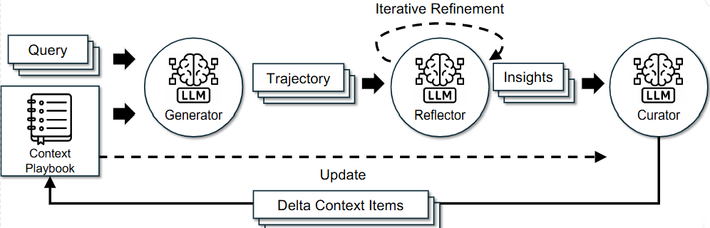
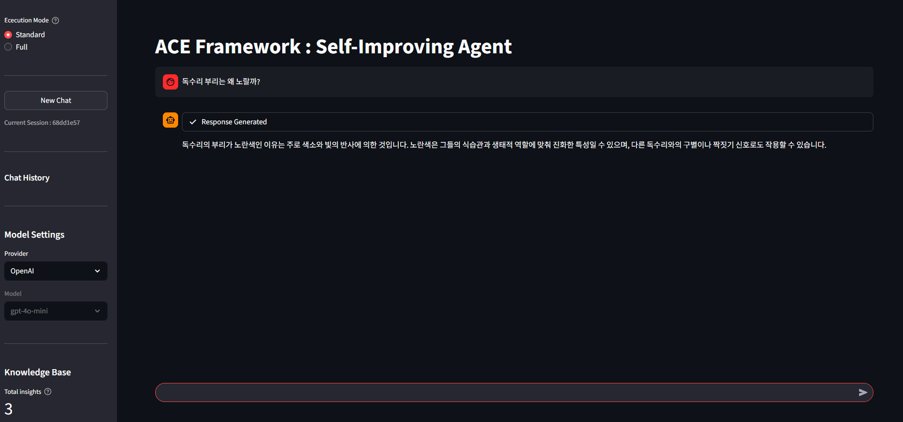
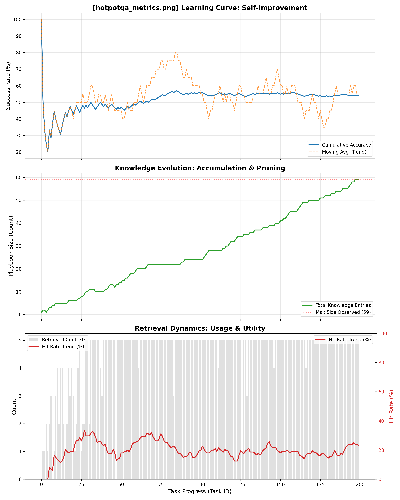
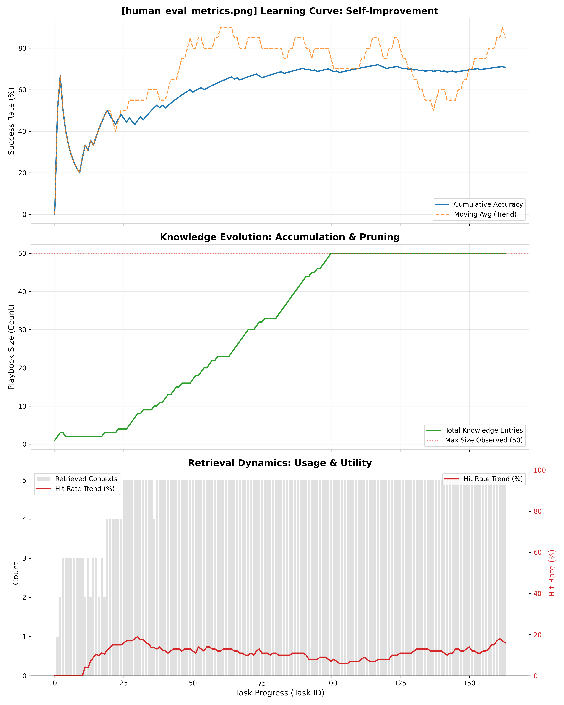
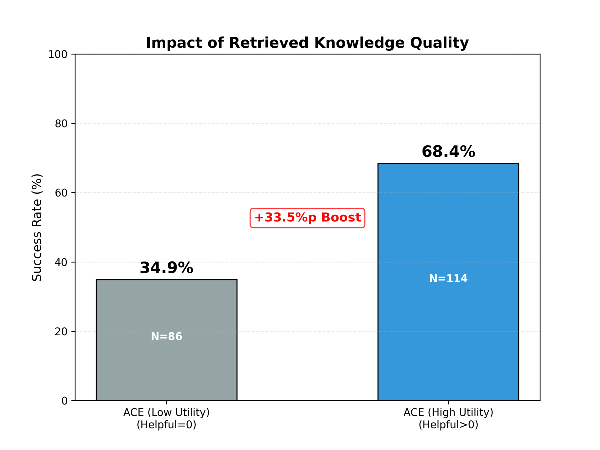
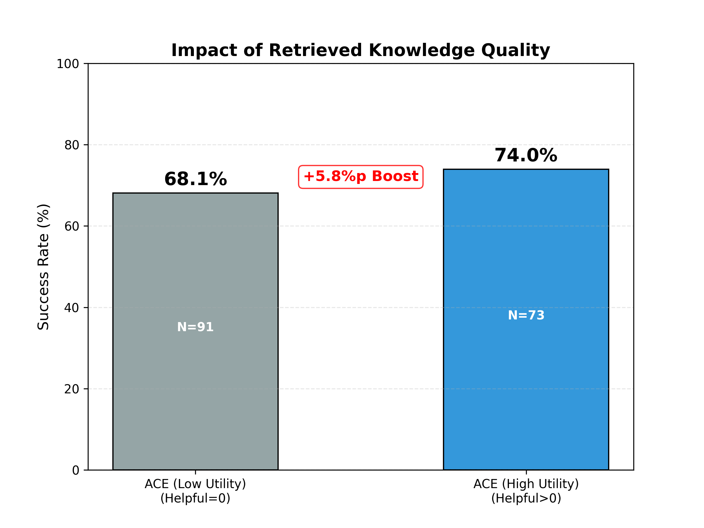
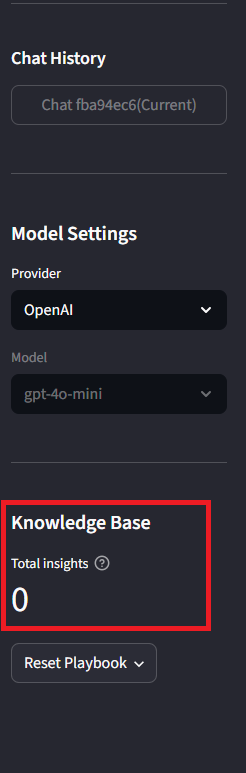

## Agentic Context Engineering (ACE)



**Agentic Context Engineering (ACE)** is a framework for self-improving Language Models that optimizes **context** rather than fine-tuning model weights. Proposed by Zhang et al. (2025), ACE addresses **Brevity Bias** and **Context Collapse** by treating context as an **Evolving Playbook**—a dynamic collection of strategies, code snippets, and lessons learned.

This repository transforms the theoretical ACE framework into a **production-ready, full-stack agentic service** featuring asynchronous learning, multi-model support, and a robust memory architecture.



## Key Features (Service-Oriented)

Unlike the original paper which focuses on the theoretical algorithm, this implementation is built for **real-world serving**.

### 1. Decoupled Architecture (Zero Latency Learning)

We separated **Inference** from **Learning** to maximize responsiveness:

- **Serving Graph**: Handles user queries, intelligent routing, and retrieval to provide immediate responses.
- **Learning Graph**: Runs in the background (asynchronous), analyzing execution trajectories to update the Playbook without blocking the user.

### 2. Multi-Provider LLM Support

Dynamically switch between SOTA models for different parts of the chain via UI/API:

- **OpenAI**
- **Anthropic**
- **Google**

### 3. Smart Routing & Mode Switching

- **Standard Mode (Async)**: Intelligent router decides if a query is "Simple" (Direct Answer) or "Complex" (ACE Playbook). Learning happens in the background.
- **Full Debug Mode (Sync)**: Forces the full cycle (Retrieve → Generate → Evaluate → Reflect → Update) for visibility and debugging.

### 4. Robust Memory & Storage Stack

- **Vector Store (Qdrant)**: Stores semantic embeddings of Playbook entries.
- **Relational DB (SQLite)**: Manages metadata, usage statistics (Helpful/Harmful counts), and timestamps.
- **Session Memory (Redis)**: Manages multi-turn chat history with sliding window context.

## Architecture

This project utilizes **LangGraph** to orchestrate three distinct state graphs:

### A. Serving Graph

Optimized for speed.

1. **Router**: Classifies query (Simple vs. Complex).
2. **Simple Generator**: Handles chitchat/facts.
3. **Retriever**: Fetches relevant strategies.
4. **Generator**: Produces solution using the Playbook.

### B. Learning Graph

Optimized for quality. Runs asynchronously via FastAPI background tasks.

1. **Evaluator**: Hybrid evaluation using **Unit Tests (Code Execution)** and **LLM Logic**.
2. **Reflector**: Diagnoses root causes of success/failure.
3. **Curator**: Synthesizes insights into `ADD` or `UPDATE` operations.
4. **Update**: Applies changes to the Playbook (Pruning & Deduplication).

### C. Full Graph

Combines both for synchronous debugging and development.

## Implementation Details & Differences

We bridge the gap between academic research and deployable services with specific enhancements.

| Feature        | Paper (Theoretical)             | Our Implementation (Production)                                                      |
| :------------- | :------------------------------ | :----------------------------------------------------------------------------------- |
| **Workflow**   | Sequential (Generate → Reflect) | **Decoupled**: Serving Graph (Fast) + Background Learning Graph                      |
| **Routing**    | Process every query             | **Semantic Router**: Distinguishes "Chitchat" vs "Strategy Tasks"                    |
| **Memory**     | Abstract concept                | **Redis**: Persistent session history management                                     |
| **Storage**    | Single source                   | **Hybrid**: Qdrant (Vector) + SQLite (Meta) + Redis (Session)                        |
| **Evaluation** | LLM Feedback only               | **Hybrid Execution**: Sandbox Code Execution + LLM Reasoning                         |
| **Language**   | English Monolingual             | **Canonical English Storage**: Multilingual Input → English Logic → Localized Output |

### Core Logic & Advanced Mechanics

#### 1. Concrete Pruning & Memory Management

The paper introduces "Grow-and-refine" abstractly. We implemented a rigorous **Memory Management Strategy**:

- **Poison Detection**: Automatically removes entries where negative feedback (Harmful) outweighs positive usage (Helpful).
- **Capacity Control (LRU)**: Enforces `MAX_PLAYBOOK_SIZE`. Evicts entries based on **Utility Score** (Helpful count) and **Recency** (Last Used).
- **Semantic Deduplication**: The Curator checks vector similarity before adding new entries to prevent context pollution.

#### 2. Cross-Lingual RAG Architecture

To prevent knowledge fragmentation:

- **Input**: User asks in any language (e.g., Korean).
- **Process**: Internal logic (Retrieval, Reflection, Curation) operates in **English** to maintain a unified knowledge base.
- **Output**: The final response is generated in the user's target language.

#### 3. Structured Retrieval Optimization

The Curator enforces a schema (`Context-Action`) to maximize retrieval accuracy for "How-to" queries.

## Evaluation & Self-Improvement Analysis

We validated the effectiveness of the ACE framework using two challenging benchmarks: OpenAI HumanEval (Code Generation) and HotpotQA (Multi-hop Reasoning). The visualizations below demonstrate how the system autonomously improves its performance over time without any weight updates.

### Learning Curve & Knowledge Dynamics

The dashboards illustrate the real-time evolution of the agent. In both domains, the agent successfully accumulates knowledge and manages its memory within the defined constraints.

#### Reasoning Benchmark (HotpotQA)



#### Coding Benchmark (HumanEval)



**Key Observations**:

- Self-Improvement (Top): The Cumulative Accuracy (Blue) shows a steady upward trend in both benchmarks. Notably, HumanEval shows rapid adaptation in the early stages as the agent learns common coding patterns.
- Memory Management (Middle): The Playbook Size (Green) stabilizes exactly at the configured limit (e.g., 50 or 60 entries). The flat line confirms that our Pruning & LRU Logic is actively removing low-utility entries to prevent context pollution.
- Retrieval Utility (Bottom): The Hit Rate (Red) correlates with the success rate, proving that the Router and Retriever are effectively fetching relevant strategies for the task at hand.

### Impact of "Helpful" Context

Does the Playbook actually help? We analyzed the success rate difference between cases where retrieved context was marked "Helpful" versus cases where it was "Low Utility" (Neutral/Harmful).

#### HotpotQA (Reasoning)



#### HumanEval (Coding)



## Installation & Usage

### Prerequisites

Before you start, ensure you have the following installed:

- Python 3.12+
- uv (Fast Python package manager)
- Redis Server (Must be running on localhost:6379)

### 1. Installation

Clone the repository and install dependencies using uv

```bash
uv sync
uv pip install -e .
```

### 2. Configuration

First, set up your environment variables

1. Copy the example config file:

```bash
# Rename the example file
mv config-example.ini config.ini
# OR just use config-example.ini (the system auto-detects it)
```

2. Open config.ini and configure your API keys and settings

⚠️ **Important Note on Embedding Models**
If you change the HUGGINGFACE_ACCESS_TOKEN status (e.g., switching from the open-source model to the gated Gemma model), you MUST reset your Vector Store and Database to avoid dimension mismatch errors

### 3. Execution

You need to run the Backend (API) and Frontend (UI) in separate terminals

#### Windows

```bash
@REM Terminal 1: Run Backend
start cmd /k "uv run python -m main"

@REM Terminal 2: Run Frontend
start cmd /k "uv run streamlit run web/app.py"
```

#### Linux / macOS

```bash
# Terminal 1: Run Backend
uv run python -m main

# Terminal 2: Run Frontend
uv run streamlit run web/app.py
```

Once running, access the application at:

Frontend (UI): http://localhost:8501
Backend (API): http://localhost:8000

**Ready Check**:
The application is fully ready to use when the Knowledge Base count appears on the sidebar (indicating that the Vector Store has been successfully loaded)



## License & Citation

This project is an open-source implementation based on the research paper "Agentic Context Engineering: Evolving Contexts for Self-Improving Language Models"

### License

This repository is released under the MIT License. You are free to use, modify, and distribute this code for both academic and commercial purposes

### Citation

If you use this code or the ACE framework in your research, please cite the original paper

```bibtex
@article{zhang2025ace,
  title={Agentic Context Engineering: Evolving Contexts for Self-Improving Language Models},
  author={Zhang, Qizheng and Hu, Changran and others},
  journal={arXiv preprint arXiv:2510.04618},
  year={2025}
}
```
